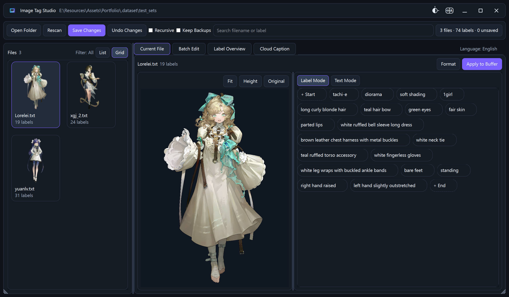
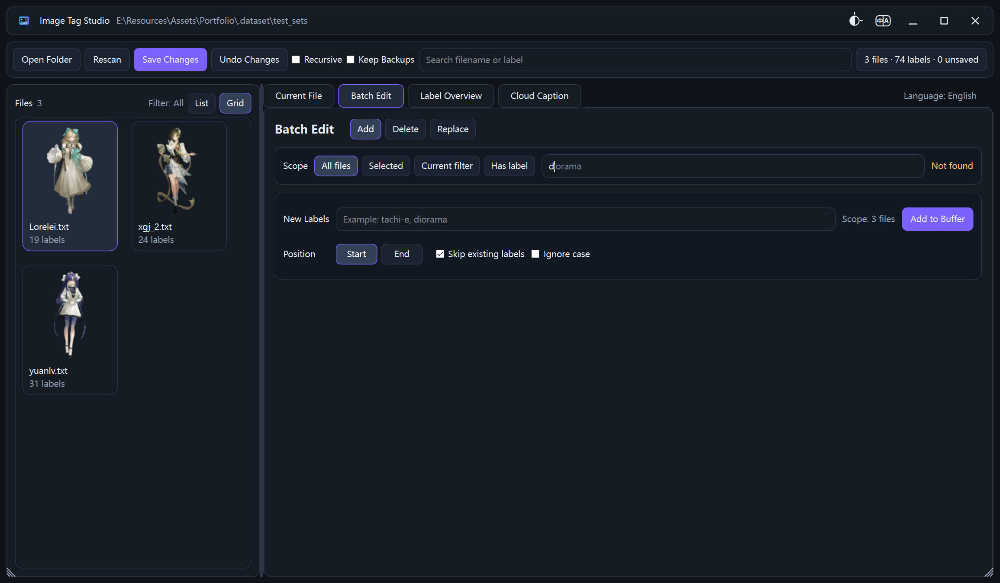
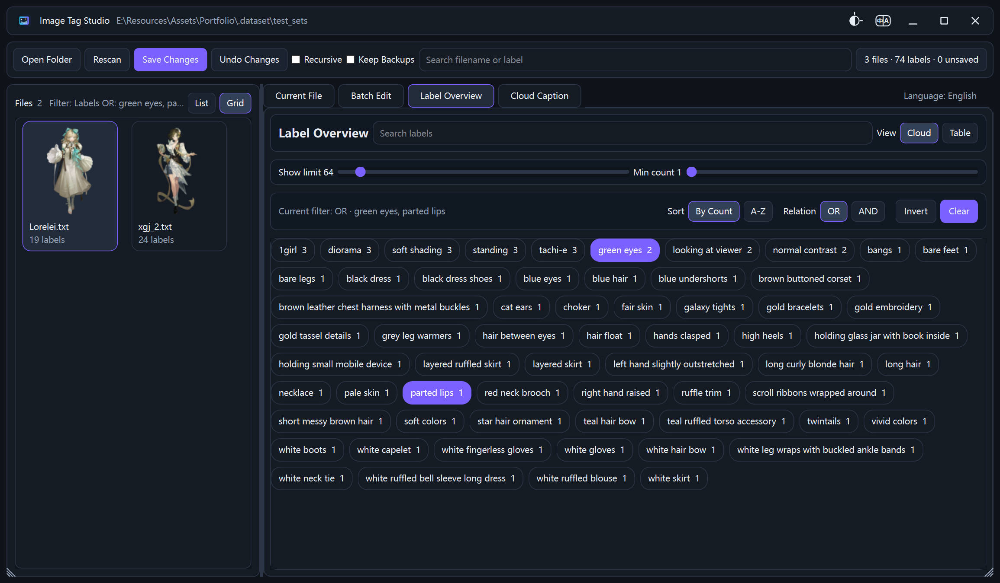
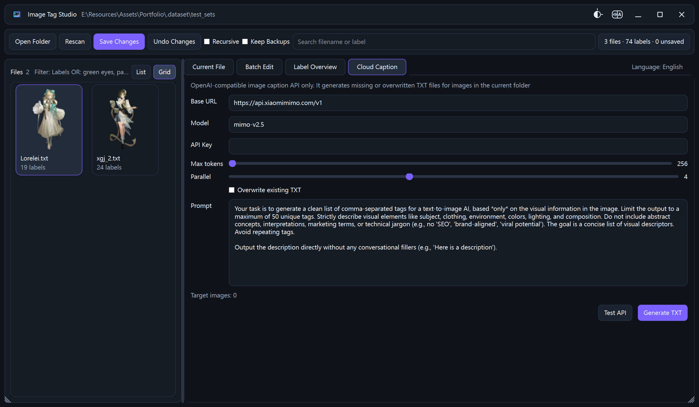

# Image Tag Studio

Image Tag Studio is a small Windows desktop tool for browsing image folders and editing sidecar `.txt` tag files.

This project grew out of a very practical workflow shift. Using image captioning or reverse tagging to generate tags, then using those tags to organize images, often feels faster and more flexible than traditional manual tagging software, especially for small collections of reference material. Image Tag Studio was created to make that workflow easier to use in a local desktop app.

It is built with Python and PySide6. During development it runs from source, and for daily use it can be packaged as a portable single-file `.exe`.

[中文说明](#中文说明)



## Features

- Open an image directory and scan matching `.txt` tag files.
- Browse files in thumbnail mode or compact list mode.
- Edit the current file in tag-chip mode or raw text mode.
- Batch add, delete, and replace tags in memory before saving.
- Review tag frequency in a cloud view or table view.
- Filter images by selected tags.
- Save with `Ctrl+S`, undo with `Ctrl+Z`, and redo with `Ctrl+Shift+Z`.
- Generate `.txt` tags with an OpenAI-compatible vision API.
- Build a portable Windows executable with the included release script.

## Screenshots

### Current File

Use this page for close review. You can edit tags inline, drag them to reorder, or switch to raw text when that feels quicker.


### Batch Edit

Apply the same tag operation to all files, selected files, filtered files, or files containing a specific tag.



### Tag Overview

Inspect tag frequency, search the vocabulary, and filter the file list from either the cloud or the table.



### Cloud Caption

Connect a compatible vision API and generate `.txt` tags for images that do not have them yet, or overwrite existing tags when needed.



## Run From Source

Python 3.10 or newer is recommended.

```powershell
python -m venv .venv
.venv\Scripts\activate
python -m pip install -r requirements.txt
python main.py
```

## Tests

```powershell
$env:QT_QPA_PLATFORM='offscreen'
.venv\Scripts\python.exe -m pytest -q
.venv\Scripts\python.exe -m compileall app tests scripts main.py
```

## Build A Portable EXE

```powershell
.venv\Scripts\python.exe scripts\package_release.py
```

The packaged executable is written to `release/ImageTagStudio.exe`. The release script also runs tests, checks compilation, records the file hash, and performs a launch probe.

## Repository Layout

```text
app/                 current PySide6 application
app/ui/              pages, widgets, theme, and dialogs
scripts/             packaging and release helpers
tests/               automated tests
ui_example/          screenshots used in this README
main.py              application entry point
requirements.txt     Python dependencies
```

---

# 中文说明

Image Tag Studio 是一个 Windows 桌面工具，用来浏览图片目录，并编辑与图片同名的 `.txt` 标签文件。

这个项目来源于一个很实际的工作流变化。先用图像反推或视觉模型生成标签，再拿这些标签去管理图片，往往比传统那种纯手动打标签的软件更省事，尤其适合小样本素材管理。Image Tag Studio 的目标，就是把这套流程做成一个本地就能顺手使用的桌面工具。

项目使用 Python 和 PySide6 编写。开发时可以直接从源码运行，日常使用可以打包成单文件便携版 exe。


## 主要功能

- 打开图片目录，扫描图片和同名 `.txt` 标签文件。
- 支持缩略图视图和紧凑列表视图。
- 当前文件支持标签气泡模式和原始文本模式。
- 支持批量添加、删除、替换标签，先进入缓存，保存时再写入磁盘。
- 标签总览支持频次统计、云图、表格、搜索和筛选。
- 可以按选中的标签筛选左侧文件列表。
- 支持 `Ctrl+S` 保存、`Ctrl+Z` 撤销、`Ctrl+Shift+Z` 重做。
- 支持通过 OpenAI 兼容视觉接口生成 `.txt` 标签。
- 自带打包脚本，可生成 Windows 单文件便携版 exe。

## 界面预览

### 当前文件

适合逐张查看和微调。可以直接编辑标签气泡、拖动调整顺序，也可以切换到文本模式快速修改。


### 批量修改

适合一次性对全部文件、选中文件、筛选结果，或包含某个标签的文件执行统一操作。


### 标签总览

适合查看标签频率、搜索标签，并直接从云图或表格里筛选图片。


### 云端识别

配置 OpenAI 兼容视觉接口后，可以为缺少标签的图片生成 `.txt`，也可以按需要覆盖已有标签。


## 从源码运行

建议使用 Python 3.10 或更新版本。

```powershell
python -m venv .venv
.venv\Scripts\activate
python -m pip install -r requirements.txt
python main.py
```

## 运行测试

```powershell
$env:QT_QPA_PLATFORM='offscreen'
.venv\Scripts\python.exe -m pytest -q
.venv\Scripts\python.exe -m compileall app tests scripts main.py
```

## 打包便携版 EXE

```powershell
.venv\Scripts\python.exe scripts\package_release.py
```

打包结果会输出到 `release/ImageTagStudio.exe`。脚本会自动运行测试、编译检查、记录哈希，并做启动验证。

## 目录说明

```text
app/                 当前维护的 PySide6 应用
app/ui/              页面、控件、主题和弹窗
scripts/             打包与发布脚本
tests/               自动化测试
ui_example/          README 使用的界面截图
main.py              程序入口
requirements.txt     Python 依赖
```
